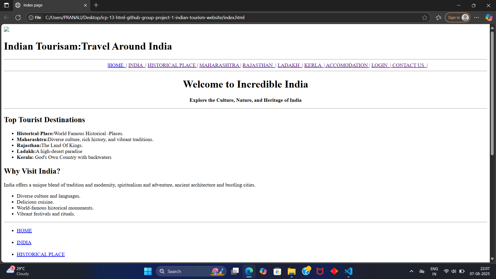

# Welcome to Incredible India!

Discover the vibrant culture, stunning landscapes, and rich heritage of India. Whether you're looking for relaxing beaches, historic landmarks, spiritual destinations, or adventure-filled experiences, India has something for everyone.

## Featured Destinations
- **Historical-Place:** World Famous Historical Places.
- **Maharashtra:** Diverse culture, rich history, and vibrant traditions.
- **Rajasthan:** The Land Of Kings.
- **Ladakh:** A high-desert paradise
- **Kerala:** God's Own Country with backwaters
-----

-----

# About India

India, the world’s second-most populous country, offers a unique blend of modern & traditional culture. With over 1.3 billion people, a rich historical legacy, and diverse landscapes, India is one of the most exciting destinations to visit.

**Key Highlights:**
- Ancient temples, fortresses, and palaces.
- Diverse cultures, languages, and festivals.
- Beaches, mountains, deserts, and forests.

# Contributers

